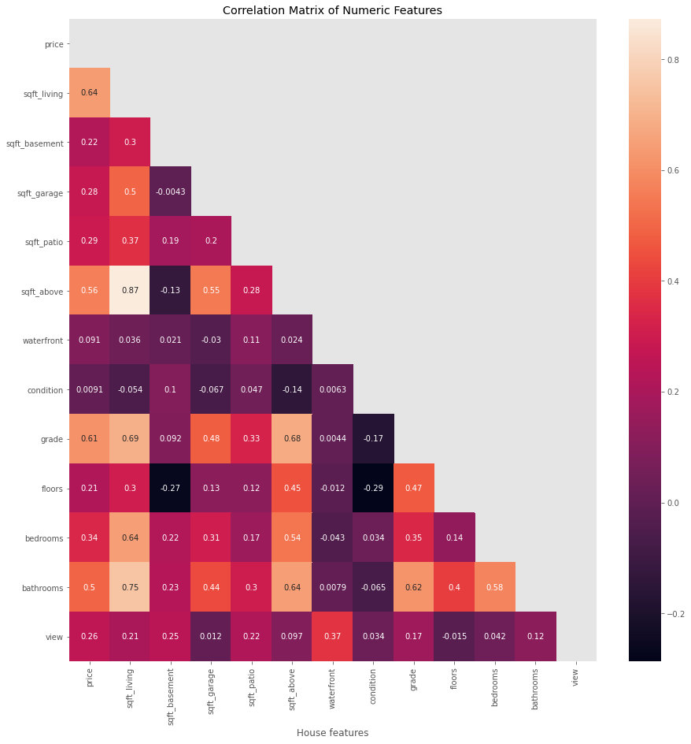
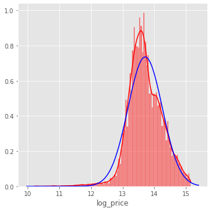
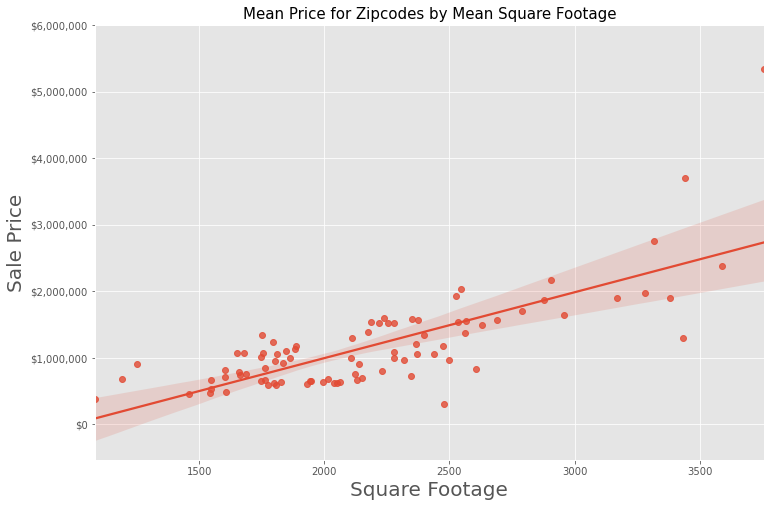
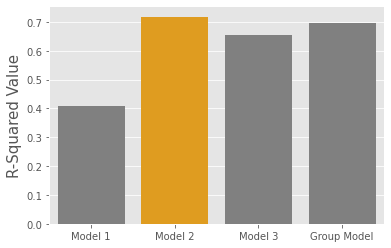
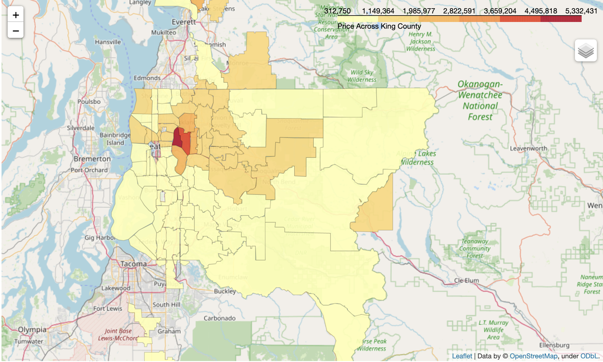

# *Sustainable Housing Analysis of King County*
***
**Author**: Kai Cansler
<br>

Photo by tierramallorca on Unsplash
<br>
## Overview
***
For the analysis we will be using data from house sales in King County Washington. We will predict home prices based upon various features within the dataset and use that information to collect possible options for investment and understand our target area. Linear regression modeling is used on various features in order to predict these prices. 

## Main Goals
We are advising retail real estate investors in understanding different prices based on ZIP code and assist in targeting potential options for further research to narrow down our investment choices.

- First, we will find the most highly correlated numerical and categorical features that can be changed to increase home value.
- Second, we will correct our model assumptions.
- Lastly, we will create model grouped on ZIP codes.

### Business and Data Understanding
***
Our Data contains information of home sales in kings county. The data has a mixture of numerical and categorical data. It contains 8 object, 5 float, and 10 integer types of features. The data contains 30,155 observations of housing data. We dropped 44 observations that had missing value for a total of 30,111 observations. 
<br>
As the data extends only about a year of homesales we will not utilize a time series analysis but focus more on linear regression. The dataset includes features such as, lat, lon that will be used to reverse geocode ZIP code information. We want to use these features to understand the average price of ZIP codes and understand average home in each area to understand what ZIP code we would like to purchase our property in. We will also use our model to price homes within those ZIP codes to find undervalued properties. This is all provided by King County as an effort to make data more accessible. From the website __[King County website](https://kingcounty.gov/en/legacy/services/data)__:
> "King County is committed to making data open, accessible and transparent. The following data resources are designed to increase public access to high value, machine readable datasets from various departments in King County government."

You can review other available datasets on their website.

### Stakeholders
***
The stakeholder for this project are investors who are looking for undervalued properties that would be great options for their investments. We are looking to generate profit by finding alpha (the difference between estimated value and real value). These homebuyers are investors looking to diversify their portfolio with real estate investment, Home buyers who are looking for a great deal for long term investment, and real estate investors looking to find arbitrage opportunities. The aim is to show what zip codes are undervalued in different zipcodes within Kings County as well as taking a look at how some of these zipcodes compare with each other. Our shareholders are looking for how the specific homes compare with the average home in different zipcodes related to square footage, condition, grade, and other features to find undervalued properties.

## Initial Data Cleaning

We looked at the histogram of the target and predictor variables to check its shape for normality assumption and to determine whether there were outliers that could be affecting our data. It was decided to remove any outliers for the target variable, 'price'.



Only relevant information for the question as well as features that would provide us useful information is kept, the columns below were removed.

- 'id': Unique identifier with no useful information.
- 'address' does not give us important information as we are focusing on ZIP for location information.
- 'lat', 'long' as we have already derived ZIP from the reverse geocoding and is no longer necessary.
- 'date' as the sale date wouldn't provide much information as it ranges only a year.
- 'yr_built', 'yr_renovated'
- 'sqft_lot' as there are many apartments from the inner city.
- 'condition' as it did not provide any valuable information for our linear regression model.

## Initial Baseline Model

### Correlation
Price is set as the target variable for the model. To start the predictor variable with the highest correlation was `sqft_living` with a correlation coefficent of 0.64.

To get an initial understanding of our data, we built a baseline simple linear regression model utilizing the feature `sqft_living` since it has the highest correlation to with the target variable.

The baseline simple linear regression model has an R-squared value of .408. This model represents 40.8% of the variance found in housing prices of the dataset. Our model is statistically significant with an F-statistic p-value less than our alpha of 0.05. The constant coefficient and predictor variable coefficient are also statistically significant when compared to our alpha. The condition number is quite high and could indicate multicollinearity in our model.

### Baseline Multi-Linear Regression Model

Now that we have our baseline simple linear regression model, and features with high correlation coefficients are removed in an attempt to reduce multicollinearity. We will expand our model and check the results of our multi-linear regression model.

We will retain all our useful numerical and catgorical data that was ordinal encoded in our new model.



We tested effects of log transforming price and square footage data to resolve issues with normality. We did not end up using that as our final model as the Adjusted R-squared did not preform as well and the interpretation of our model was not useful for our business understanding. Our goal is to model home prices so that we can find undervalued homes and interpretting our features as percentage changes will be difficult to communicate.

## Results

- Our final model explains about 71.8% of the variance in the data overall.
- Our model is statistically significant when compareed to our alpha = 0.05.
- P-values for `sqft_living`, `sqft_basement`, `sqft_garage`, and `sqft_patio` are statistically significant.
- p-values for majority of ZIP codes are statistically significant.
- The MAE for our final model indicates potential variance of about $215,940 dollars



### Interpretation
**Importance:**
- When looking at the standardized model, we see that `sqft_living` has the highest coefficient.
    - This means that increasing square foot living area will have the most drastic change to house price and is a major factor when it comes to real estate pricing.

when we look at our regular model we can get some good interpretation taking everything else into consideration



**Changes in Numerical Variables:**
- When we look at our non-standardized final model, we can get additional insight:
    - A house with lowest quality grade and all variables held at 0 the house would have a price of \$115,300.00.
        - For every 1 sq ft increase in living area, we would expect the house value to increase by about \$290.70
    - For every 1 square ft increase in sqft_basement all else held at 0 the house price is expected to decrease by \$68.43.
    - For every 1 square ft increase in sqft_patio all else held at 0 the house price is expected to increase by \$60.27.
    - For every 1 unit increase in floors all else held at 0 the house price is expected to decrease \$55,240.00.

**Changes in Categorical Variables:**
- We see statistically significant coefficients for conditional variables:
    - For every 1 point increase in grade all else held at 0 the house pricee is expected to increase \$110,200.00.
    - If waterfront is true holding all else held at 0 the house price is expected to increase \$285,700.00.
    - For every 1 unit increase in view holding all else at 0 the house price is expected to increase \$75,750.00.
- The majority of ZIP code coefficients compared to 98001 are statistically significant:
    - ZIPCODE_98004 has an increase of /$1,260,000.00 when all other variables are held at 0.
    - ZIPCODE_98422 has an decrease of /$922,400.00 when all other variables are held at 0.    

### Recommendations
Based on the data we gathered, ZIP code and square footage of living space is the most important factor when it comes to the value of real estate property.
For every 100 square foot increase in living area you can expect to see on average a $29,070.00 increase in sale price. 
Square footage of basement and patio did not have a significant effect on the overall price. This could be because inner city properties are priced higher from demand and tend to not have patios and basements due to housing being apartments. 



The closer we are to the inner city the more capital that will be required for our investment. If we are looking to invest with less capital focusing our investment on areas surrounding them will be our best interest.
We can utilize the model to identify properties that are selling for less than the expected price and narrow down potential investment opportunities. With further research on the area the property is in, the quality of the home, and trend in demand, we can locate undervalued homes with high potential for return.

## Next steps
Besides our recommendations there are some important factors to be weary of.

While this model had a low p-value and can be deemed statistically significant the condition number is quite high and can be an indicator of multicollinearity. 

Some of the ZIP code categories are not statistically significant when compared with the alpha of 0.05. We will need to collect more data to train our model to potentially correct some of these issues.

Lastly, the linear regression model may not the best modeling technique for our dataset. Further research should be conducted using other methods to alleviate any of the assumptions that are not being met with our dataset and the assumptions for the linear regression model.

## For More Information

See the full analysis in the [Jupyter Notebook](./student.ipynb) or review this [presentation](./presentation.pdf).

# Repository Structure

```
├── student.ipynb
├── data
│   ├── Clean_King_County_Zipcodes.geojson
│   ├── Zipcodes_for_King_County.geojson
│   ├── Zipcodes_for_King_County_and_Surrounding_Area___zipcode_area.cpg
│   ├── column_names.md
│   ├── Zipcodes_for_King_County_and_Surrounding_Area___zipcode_area.dbf
│   ├── Zipcodes_for_King_County_and_Surrounding_Area___zipcode_area.dbf
│   ├── Zipcodes_for_King_County_and_Surrounding_Area___zipcode_area.prj
│   ├── kc_house_data.csv
│   ├── Zipcodes_for_King_County_and_Surrounding_Area___zipcode_area.shp
│   ├── Zipcodes_for_King_County_and_Surrounding_Area___zipcode_area.shx
│   └── Zipcodes_for_King_County_and_Surrounding_Area___zipcode_area.xml
├── visualizations
│   ├── mean_sqft_vs_mean_price.png
│   ├── corr_matrix.png
│   ├── heat_map.png
│   ├── home.jpg
│   ├── log_price.png
│   ├── mean_sqft_vs_mean_price.png
│   └── model_performance.png
├── price_map_files
├── price_map.html
├── King_County_Renovation_Presentation.pdf
└── README.md
```
